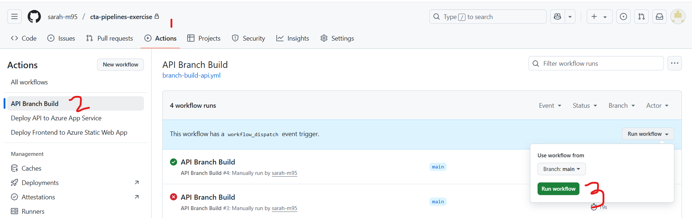
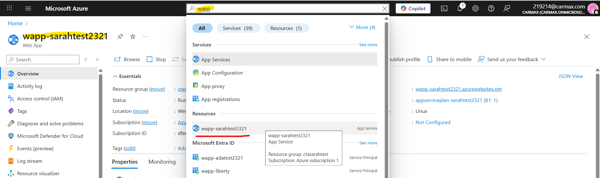

# GitHub Actions Pipeline Exercise

## Overview

This repository contains a sample application with both backend (.NET Core) and frontend (React/Vite) components. You'll use this project to learn how to create and configure GitHub Actions workflows for automated building, testing, and deployment.

## Introduction to GitHub Actions & Build Pipelines

**GitHub Actions** is a CI/CD (Continuous Integration/Continuous Deployment) platform that allows you to automate your software development workflows directly in your GitHub repository.

### Key Concepts

- **Workflow**: An automated process defined by a YAML file in `.github/workflows/`
- **Job**: A set of steps that execute on the same runner
- **Step**: An individual task that can run commands or actions
- **Runner**: A server that runs your workflows (GitHub-hosted or self-hosted)
- **Action**: A reusable unit of code that performs a specific task

### Why Use Build Pipelines?

- **Automation**: Eliminate manual, error-prone deployment processes
- **Consistency**: Ensure the same steps are followed every time
- **Quality Assurance**: Run tests automatically before deployment
- **Fast Feedback**: Quickly identify issues when code is committed
- **Collaboration**: Team members can see build status and deployment history

## Exercise Steps

### Prep: Before you start

***You will need a personal GitHub account (aka not tied to your CarMax email!) for this activity. If you don't have one, create one now!***

1. In your personal GitHub account, go ahead and create a new repository. Call it whatever you like, this will be the long-term home for your resume site so that you can keep the project going even after you leave CarMax. You may make the project private or public, whatever you're comfortable with.

2. Log in to your personal GitHub in the CLI or in GitHub desktop and pull it down to your local machine. We're going to start scaffolding the project now!

**Note: If you would like, you can copy the code from this project, as it is based off of the "answer keys" given to me by your instructors. However, if you have personal touches on your front end or backend work, continue with the following instructions.**

3. In the root folder, feel free to drop what you have from the cta-csharp-exercise. Once it's copied over, we're going to enter the `/src` folder and put the .sln file and the csharp projects into a new folder called `backend`. This way, all our backend code will be in one place. Let's also drop the `README.md` file that got copied over in there as well. This way the documentation for the backend will live with the backend code, and you can set up your own `README.md` at the root level. Your project structure should look like this:

```
src/
└── backend/
    ├── README.md
    ├── Cta.Exercise.sln
    ├── Cta.Exercise.Service/
    ├── Cta.Exercise.Application/
    └── Cta.Exercise.Core/
```

Confused? Use this repository as an example. I've also included an overall [project structure](#project-structure).

4. Now, we're going to copy over our front end code. Make a folder in `/src` called `frontend`. This is where all our frontend code will go. Now, go to the code you've been working on from the cta-front-end exercise. Go ahead and copy everything (except the hidden .git folder) in the root of that project and paste it in `/src/frontend`.

If you're not sure if you've set your project up correctly, please reference this project's structure or look at [project structure](#project-structure).

5. When you're satisfied with how your project looks, go ahead and push the code to the remote repository in GitHub. You'll know you've succeeded when you can navigate to your project in GitHub.com and see the new contents of your project.

### Part 1: Setting up your branch build

1. Let's start - Create a folder in your root folder called `.github` and in that `.github` folder, create another folder called `workflows`. This is where our pipelines are going to live as code. While a pipeline is a series of steps taken to deploy an application, we can use code to define those steps so that they are the same every time, we can exercise version control over changes to those steps, and we can restore the steps in case the builds ever got deleted.

2. Open your project in VS Code. We'll be editing all our code here. in the `.github/workflows` folder you just created, make a new file. Call it `branch-build-api.yml`. The package suffix indicates that this file is in the YAML programming language. You don't need to know a ton about YAML, just know that it's a way to define a data object & properties. Essentially what it's doing is defining the structure and properties of your build pipeline. This is fed to GitHub, and GitHub interprets it into a GitHub Actions workflow.

3. For this first pipeline, I'm going to have you guys copy some code from this repo rather than write it from scratch. Go to [.github\workflows\branch-build-api.yml](.github\workflows\branch-build-api.yml) and copy that into your own file. We're going to walk through what this file is doing in person, but if you're looking at this on your own, please read the yaml file and the comments about what each section is doing. It's all fairly straightforward, but it can be confusing if you've never seen YAML or if you're new to build pipelines.

4. Commit your changes to GitHub. Now, if you go to the `Actions` tab, you should see your build appear with the name "API Branch Build". Let's run it together. In the `Actions` tab, select "API Branch Build" from the left hand menu. Take a peek at the following screenshot if you're confused:


This build only focuses on the backend code. It tells the `runner` (aka the computer that GitHub owns that executes workflow actions) to download your code, restore NuGet packages, build the project, and run any unit tests if they exist.

### Part 2: Setting up your backend API deployment

1. Back in VS Code, let's set up another YAML file, this time we'll call it `deploy-api.yml`. Create it in the same folder as before. Now that we've run our first pipeline and we know our backend builds just fine, let's try deploying it to Azure. In your Azure class with Joe, he had you guys provision some resources in the cloud. One of those resources was an app service which is currently an empty server waiting for some code to run on it. Let's send it some code!

2. Copy the code in this repo from [.github\workflows\deploy-api.yml](.github\workflows\deploy-api.yml) into your new file. Let's read through the code together to understand the kind of pipeline it's defining. You'll notice that we have a couple of parameters we need to fill in. First, on line 18, there's an environment parameter called `AZURE_WEBAPP_NAME`. This is the name of the app service we deployed to Azure. Let's go grab that...

3. Log in to the [Azure Portal][https://portal.azure.com] using your numbered account. To find your app service quickly, search "wapp" in the search bar at the top of the screen. Navigate to the resource when it appears. Alternatively, you can search for the subscription you set up with Joe and find the App Service resource there. Remember to look for the App Service, no the App Service Plan. An app service plan just describes to Azure what kind and how many servers to dedicate to the app service, whereas the app service is the actual representation of those servers (more or less). Copy the name of the resource and paste it as the value for `AZURE_WEBAPP_NAME` on line 18 of our workflow.


### Part 3: Setting up your frontend deployment

## Project Structure
```
src/
├── backend/          # .NET Core Web API
|   ├── README.md
│   ├── Cta.Exercise.sln
│   ├── Cta.Exercise.Service/
│   ├── Cta.Exercise.Application/
│   └── Cta.Exercise.Core/
└── frontend/         # React/Vite Application
    ├── package.json
    ├── src/
    └── public/
```

## Further Reading

### GitHub Actions Documentation
- [GitHub Actions Documentation](https://docs.github.com/en/actions)
- [Workflow Syntax](https://docs.github.com/en/actions/using-workflows/workflow-syntax-for-github-actions)
- [GitHub Actions Marketplace](https://github.com/marketplace?type=actions)

### CI/CD Best Practices
- [CI/CD Best Practices](https://docs.github.com/en/actions/guides/about-continuous-integration)
- [Security Hardening for GitHub Actions](https://docs.github.com/en/actions/security-guides/security-hardening-for-github-actions)

### Technology-Specific Resources
- [Building and Testing .NET](https://docs.github.com/en/actions/automating-builds-and-tests/building-and-testing-net)
- [Building and Testing Node.js](https://docs.github.com/en/actions/automating-builds-and-tests/building-and-testing-nodejs)
- [Deploying to Azure](https://docs.github.com/en/actions/deployment/deploying-to-your-cloud-provider/deploying-to-azure)
