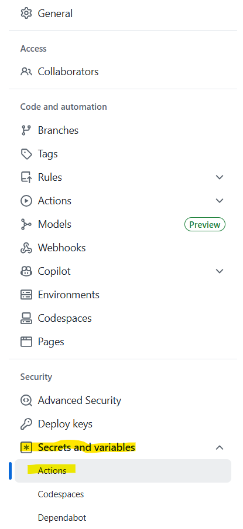
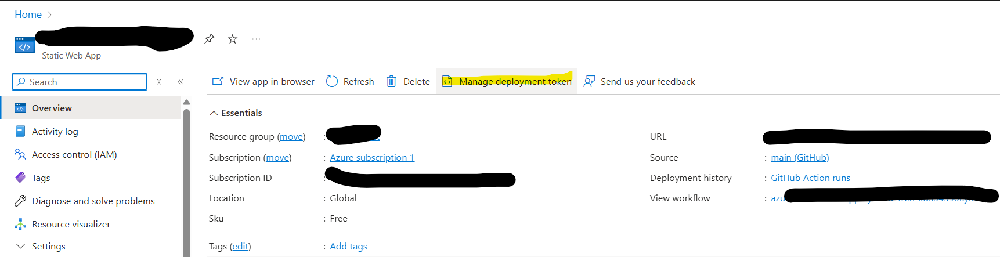

# GitHub Actions Pipeline Exercise

## Overview

This repository contains a sample application with both backend (.NET Core) and frontend (React/Vite) components. You'll use this project to learn how to create and configure GitHub Actions workflows for automated building, testing, and deployment.

## Introduction to GitHub Actions & Build Pipelines

**GitHub Actions** is a CI/CD (Continuous Integration/Continuous Deployment) platform that allows you to automate your software development workflows directly in your GitHub repository.

### Key Concepts (GitHub Actions specific)

- **Workflow**: An automated process defined by a YAML file in `.github/workflows/`
- **Job**: A set of steps that execute on the same runner
- **Step**: An individual task that can run commands or actions
- **Runner**: A server that runs your workflows (GitHub-hosted or self-hosted)
- **Action**: A reusable unit of code that performs a specific task

### Why Use Build Pipelines?

- **Automation**: Eliminate manual, error-prone deployment processes
- **Consistency**: Ensure the same steps are followed every time
- **Quality Assurance**: Run tests automatically before deployment
- **Fast Feedback**: Quickly identify issues when code is committed
- **Collaboration**: Team members can see build status and deployment history

## Exercise Steps

### Table of Contents
- [Prep: Before you start](#prep-before-you-start)
- [Part 1: Setting up your branch build](#part-1-setting-up-your-branch-build)
- [Part 2: Setting up your backend API deployment](#part-2-setting-up-your-backend-api-deployment)
- [Part 3: Setting up your frontend deployment](#part-3-setting-up-your-frontend-deployment)

### Prep: Before you start

***You will need a personal GitHub account (aka not tied to your CarMax email!) for this activity. If you don't have one, create one now!***

1. In your personal GitHub account, go ahead and create a new repository. Call it whatever you like, this will be the long-term home for your resume site so that you can keep the project going even after you leave CarMax. You may make the project private or public, whatever you're comfortable with.

2. Log in to your personal GitHub in the CLI or in GitHub desktop and pull it down to your local machine. We're going to start scaffolding the project now!

**Note: If you would like, you can copy the code from this project, as it is based off of the "answer keys" given to me by your instructors. However, if you have personal touches on your front end or backend work, continue with the following instructions.**

3. In the root folder, feel free to drop what you have from the cta-csharp-exercise. Once it's copied over, we're going to enter the `/src` folder and put the .sln file and the csharp projects into a new folder called `backend`. This way, all our backend code will be in one place. Let's also drop the `README.md` file that got copied over in there as well. This way the documentation for the backend will live with the backend code, and you can set up your own `README.md` at the root level. Your project structure should look like this:

```
src/
└── backend/
    ├── README.md
    ├── Cta.Exercise.sln
    ├── Cta.Exercise.Service/
    ├── Cta.Exercise.Application/
    └── Cta.Exercise.Core/
```

Confused? Use this repository as an example. I've also included an overall [project structure](#project-structure).

4. Now, we're going to copy over our front end code. Make a folder in `/src` called `frontend`. This is where all our frontend code will go. Now, go to the code you've been working on from the cta-front-end exercise. Go ahead and copy everything (except the hidden .git folder) in the root of that project and paste it in `/src/frontend`.

If you're not sure if you've set your project up correctly, please reference this project's structure or look at [project structure](#project-structure).

5. When you're satisfied with how your project looks, go ahead and push the code to the remote repository in GitHub. You'll know you've succeeded when you can navigate to your project in GitHub.com and see the new contents of your project.

### Part 1: Setting up your branch build

1. Let's start - Create a folder in your root folder called `.github` and in that `.github` folder, create another folder called `workflows`. This is where our pipelines are going to live as code. While a pipeline is a series of steps taken to deploy an application, we can use code to define those steps so that they are the same every time, we can exercise version control over changes to those steps, and we can restore the steps in case the builds ever got deleted.

2. Open your project in VS Code. We'll be editing all our code here. In the `.github/workflows` folder you just created, make a new file. Call it `branch-build-api.yml`. The file suffix indicates that this file is in the YAML programming language. You don't need to know a ton about YAML, just know that it's a way to define a data object & properties. Essentially what it's doing is defining the structure and properties of your build pipeline. This is fed to GitHub, and GitHub interprets it into a GitHub Actions workflow.

3. For this first pipeline, I'm going to have you guys copy some code from this repo rather than write it from scratch. Go to [.github\workflows\branch-build-api.yml](.github/workflows/branch-build-api.yml) and copy that into your own file. We're going to walk through what this file is doing in person, but if you're looking at this on your own, please read the yaml file and the comments about what each section is doing. It's all fairly straightforward, but it can be confusing if you've never seen YAML or if you're new to build pipelines.

4. Commit your changes to GitHub. Now, if you go to the `Actions` tab, you should see your build appear with the name "API Branch Build". Let's run it together. In the `Actions` tab, select "API Branch Build" from the left hand menu. Take a peek at the following screenshot if you're confused:


This build only focuses on the backend code. It tells the `runner` (aka the computer that GitHub owns that executes workflow actions) to download your code, restore NuGet packages, build the project, and run any unit tests if they exist.

### Part 2: Setting up your backend API deployment

1. Back in VS Code, let's set up another YAML file, this time we'll call it `deploy-api.yml`. Create it in the same folder as before. Now that we've run our first pipeline and we know our backend builds just fine, let's try deploying it to Azure. In your Azure class with Joe, he had you guys provision some resources in the cloud. One of those resources was an app service which is currently an empty server waiting for some code to run on it. Let's send it some code!

2. Copy the code in this repo from [.github\workflows\deploy-api.yml](.github/workflows/deploy-api.yml) into your new file. Let's read through the code together to understand the kind of pipeline it's defining. You'll notice that we have a couple of parameters we need to fill in. First, on line 18, there's an environment parameter called `AZURE_WEBAPP_NAME`. This is the name of the app service we deployed to Azure. Let's go grab that...

3. Log in to the [Azure Portal](https://portal.azure.com) using your numbered account. To find your app service quickly, search "wapp" in the search bar at the top of the screen. Navigate to the resource when it appears. Alternatively, you can search for the subscription you set up with Joe and find the App Service resource there. Remember to look for the App Service, not the App Service Plan. An app service plan just describes to Azure what kind and how many servers to dedicate to the app service, whereas the app service is the actual representation of those servers (more or less). Copy the name of the resource and paste it as the value for `AZURE_WEBAPP_NAME` on line 18 of our workflow.


4. Let's go back to our YAML file. Now, we're no longer missing any environment variables, but if we read the code, we'll notice references to `secrets.AZURE_CREDENTIALS`. Where's that getting defined? GitHub actions have the concept of `secrets`, which are secure variables we don't want exposed to the internet. These include any authentication credentials, and in this case what we need are credentials that allow GitHub to talk to Azure. They're basically your passkey for letting GitHub upload your code to the app service. We'll need to generate those! To start, let's open the Powershell terminal:


Run `az login` from the command line. This should prompt you to log in to Azure using your numbered account.


Once you're logged in, run the following command in the terminal: `az ad sp create-for-rbac --name "github-actions-sp" --role contributor --scopes /subscriptions/{subscription-id}`

For subscription id, you'll need to get that from the Azure Portal. If you log into https://portal.azure.com you'll see your resources (or just navigate back to the tab we were working in earlier to grab the app service name). If you're looking at your app service or any other resource you provisioned in your subscription, you'll see a property in the "Overview" tab called "Subscription ID." It is a GUID. That's the value you need! Insert it into the command I just shared where `{subscription-id}` is and run it!

5. Now, we're going to store that newly created Service Principal somewhere our pipeline can access it, but it won't be exposed to random people on GitHub. Copy the output from the command (assuming it ran successfully). Don't close the terminal in case you lose the value before saving it. Go to your repository in GitHub. Navigate to the "Settings" tab.


In the left-hand menu, go to the "Secrets and variables" dropdown, and select "Actions."



Now click "New repository secret."


Your secret name is `AZURE_CREDENTIALS` and the value is the JSON you copied from the terminal. That value should look something like this:
```json
{
  "appId": "xxxxxxxx-xxxx-xxxx-xxxx-xxxxxxxxxxxx",
  "displayName": "github-actions-sp",
  "password": "xxxxxxxxxxxxxxxxxxxxxxxxxxxxxxxxxxxxxxxx",
  "tenant": "xxxxxxxx-xxxx-xxxx-xxxx-xxxxxxxxxxxx"
}
```

It's okay if there are some extra values in there, the important parts are appId, password, and tenant. Save the secret.

6. OK, now our pipelines should be good! Commit your changes to your remote repository. Once you have, navigate to the Actions tab. Under Workflows, you should see a new workflow called "Deploy API to Azure App Service." If it's not already running, go ahead and kick it off. Your build should finish successfully.

If your build finishes successfully, go ahead and try hitting an api route:
`https://{appName}.azurewebsites.net/hobby`

You should see JSON results in the browser. Congrats! Your backend api is successfully up and running in Azure and is accessible to any front-end we might deploy.

### Part 3: Setting up your frontend deployment

1. We're almost done! Back in VS Code, let's spin up a final pipeline, this one we'll call `deploy-front-end.yml` and we'll keep it stored in the exact same folder as the other workflows. Once again, copy the pipeline I've set up for you from [.github\workflows\deploy-front-end.yml](.github/workflows/deploy-front-end.yml). We're going to read through it to understand what the workflow is doing, then look for any variables or secrets that need to be filled in.

This time, you'll notice our variables under `env` are good, but we're missing three secrets. Using the same steps we just followed for the Azure Credentials, let's add what we're missing.

2. The first secret is easy - you're going to add a secret with the name `ARTIFACTORY_USERNAME` and its value will be your employee ID. Save that secret, and let's move on to the next.

Next, we're going to focus on the secret `ARTIFACTORY_PASSWORD`. This is a token generated from our Artifactory account. Go to https://carmax.jfrog.io/ and log in. Then, click the profile picture icon in the top right, and select "Edit Profile."


Then, select "Generate an Identity Token."


You can name it anything, I named mine "CTA Pipelines Project." Just make sure it's identifiable to you later. The long string of numbers and characters it generates is your identity token and the value for your next secret. Copy it, and go back to GitHub.

Add a secret with the name `ARTIFACTORY_PASSWORD` and the value is the string you just copied from JFrog. Save it.

Finally, we need a secret called `AZURE_STATIC_WEB_APPS_API_TOKEN`. Deploying to a SWA app requires a different set of credentials from the Azure SPO we used to deploy the API. Let's go to [Azure](https://portal.azure.com). Log in and find your Static Web App resource. There should be a button called "Manage deployment token." Click it.



Copy the deployment token Azure provides to you. Let's go back to GitHub and add our final secret. The name should be `AZURE_STATIC_WEB_APPS_API_TOKEN` and its value should be the string you just copied. Save it. Leave this webpage up, as we'll need to refer back to it in just a few minutes.

3. Head back to your pipeline file in VS Code. Commit any uncommitted changes, and head back to the GitHub Actions tab. You should see a workflow called "Deploy Frontend to Azure Static Web App." Go ahead and run that workflow, and it should succeed.

4. OK, so your pipeline ran successfully, but where's the code? Go back to Azure and you should see `URL` as one of the properties on your Azure Static Web App. It will look super weird, probably like a jumble of random words and characters - that's because it's autogenerated to be unique by Azure. If you click that link, it should take you to your Resume site! And on first glance, it looks great. We can see the front-end components loading. However, if you navigate to the Hobbies or Skills pages, you'll notice that nothing gets loaded, and if we try to add a new hobby or skill, nothing gets added.

If you open the developer tools, you'll notice that the requests are failing and it's saying something about our CORS policy. There's a lot to cover related to CORS, but essentially, CORS (Cross-Origin Resource Sharing) is a security feature built into web browsers that blocks web pages from making requests to a different domain, port, or protocol than the one serving the web page. It's essentially saying your front end site and api have different URLs, so they're not allowed to talk to each other by default. We're going to have to whitelist our front end on the API side.

5. Alright, one last code push - let's open our project in VS Code or Visual Studio, whichever you're more comfortable in. The change is going to be super simple. You will need the URL of your front end and we're going to explicitly whitelist it with our API. Go to `src/backend/Cta.Exercise.Service/Program.cs`. We're going to look for the section under the comment `// Add CORS policy`.

You're going to edit line 31 so that it reads `policy.WithOrigins("http://localhost:5173", "https://{myURL}.azurestaticapps.net")`. Please note that there is no trailing forward slash included in the URL, if you have one, your change won't work!

Here's a visual example of what the change should look like:


Push your latest changes to GitHub.

6. If you've pushed your changes to the remote, your API deployment should automatically kick off. Check for it in the GitHub Actions tab. Once that build completes, you should be able to reload the front end portion of your site, and tada! Your frontend now has access to your backend, and it can display your hobbies and skills correctly!

Congrats! You've completed the activity! You now have working pipelines for your personal site! You can make whatever changes you like, commit them here in this repo, and the changes will carry over into the site you've deployed to Azure.

## Project Structure
```
src/
├── backend/          # .NET Core Web API
|   ├── README.md
│   ├── Cta.Exercise.sln
│   ├── Cta.Exercise.Service/
│   ├── Cta.Exercise.Application/
│   └── Cta.Exercise.Core/
└── frontend/         # React/Vite Application
    ├── package.json
    ├── src/
    └── public/
```

## Next Steps
If you want to keep developing your app further, try adding some security features. Your app should only be editable by yourself, so try adding authentication to the API and a login/logout function to the front-end.

Ideally, we shouldn't be enabling cross-site requests in our API with the CORS exception we added. Figure out a way around that and your requests to your API will be more secure. Hint: Azure static web apps can be deployed with an api component to represent a unified Azure Static Web App.

You can also work in Azure with the Static Web App to create a custom domain for your site, so that the URL isn't some crazy combination of words and characters.

## Further Reading

### GitHub Actions Documentation
- [GitHub Actions Documentation](https://docs.github.com/en/actions)
- [Workflow Syntax](https://docs.github.com/en/actions/using-workflows/workflow-syntax-for-github-actions)
- [GitHub Actions Marketplace](https://github.com/marketplace?type=actions)

### CI/CD Best Practices
- [CI/CD Best Practices](https://docs.github.com/en/actions/guides/about-continuous-integration)
- [Security Hardening for GitHub Actions](https://docs.github.com/en/actions/security-guides/security-hardening-for-github-actions)

### Technology-Specific Resources
- [Building and Testing .NET](https://docs.github.com/en/actions/automating-builds-and-tests/building-and-testing-net)
- [Building and Testing Node.js](https://docs.github.com/en/actions/automating-builds-and-tests/building-and-testing-nodejs)
- [Deploying to Azure](https://docs.github.com/en/actions/deployment/deploying-to-your-cloud-provider/deploying-to-azure)
